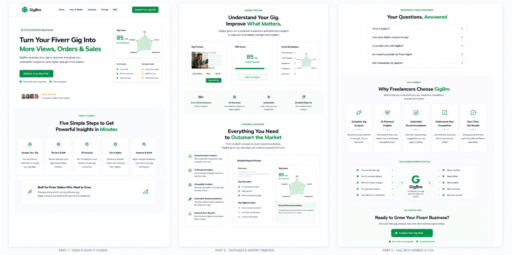
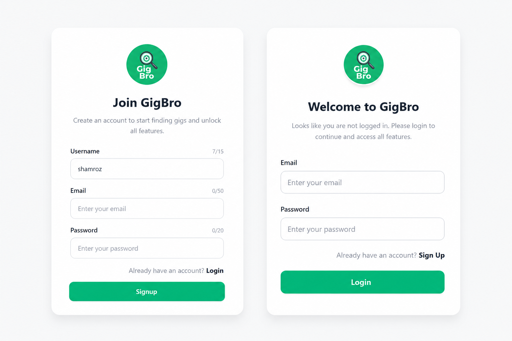
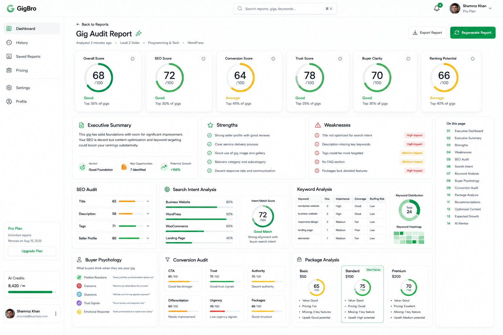

## AI-powered Fiverr Gig Analyzer
A AI-bot that will go to your gig like a researcher, analysis your content and provide suggestion which is essential 
for your gig to get rank and attract clients.

---
# 🛠️ Tech Stack

## Frontend
- React.js
- Vite
- JavaScript (ES6+)
- Tailwind CSS
- HTML5
- CSS3

## Backend
- FastAPI
- Python 3
- Uvicorn

## Database
- MySQL

## AI & LLM
- OpenAI API
- Groq API

## Web Scraping
- Selenium
- BeautifulSoup4 (BS4)

## Authentication
- JWT (JSON Web Tokens)
- HTTP Cookies

## Browser Extension
- Chrome Extension (Manifest V3)
- Chrome Extension APIs
  - chrome.storage
  - chrome.cookies
  - chrome.tabs
  - chrome.runtime
  - chrome.scripting

## Data Processing
- Pydantic
- JSON

## Development Tools
- Git
- GitHub
- VS Code
- Postman

## Deployment & Environment
- Python Virtual Environment (venv)
- dotenv (.env)
- CORS Middleware

## APIs & Communication
- REST API
- Fetch API

## Architecture
- Client-Server Architecture
- RESTful API Design
- AI-Powered Content Analysis
---

### Work-Flow:

### Visuals:

## 🚀 Tech Stack

