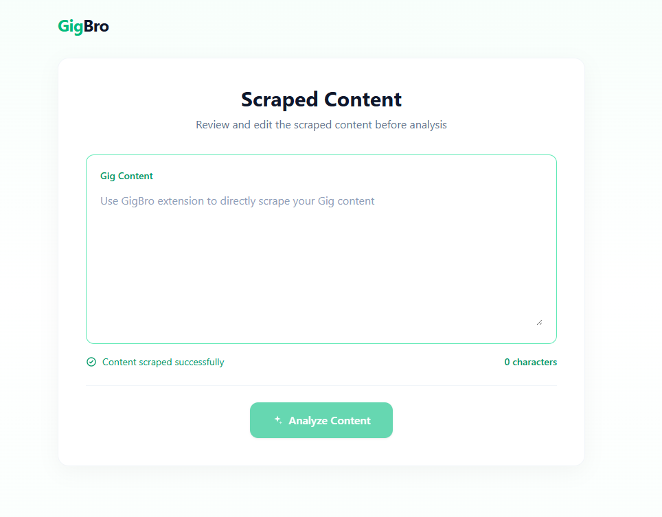
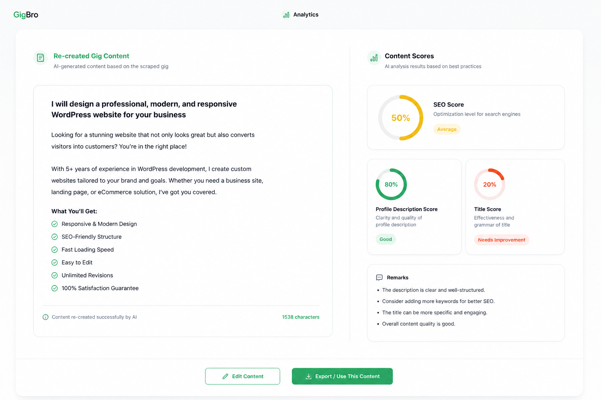

## AI-powered Fiverr Gig Analyzer
A AI-bot that will go to your gig like a researcher, analysis your content and provide suggestion which is essential 
for your gig to get rank and attract clients.

---
### Tech-Stack:
- Backend:
    - Language: Python
    - Library: FastAPI, OpenAI, pymysql
- Frontend:
     - Framework: ReactJS, JavaScript
     - Library: Tailwindcss
- Database:
    - MySQL (later shift to PostgreSQL)
---

### Work-Flow:

### Visuals:

